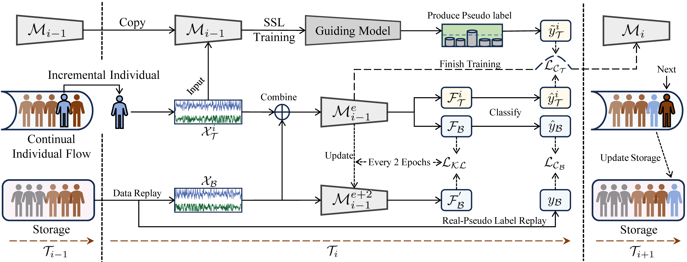
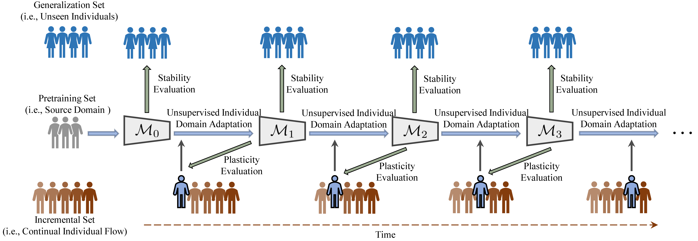

<div align="center">
  
# BrainUICL


_An Unsupervised Individual Continual Learning Framework for EEG Applications_

🔥 NEWS: This paper has been accepted by ICLR 2025

## 🔍 About
We propose **BrainUICL**, a novel unsupervised individual continual learning framework, for continual EEG decoding on various clinical and BCI application.
The camera-ready version of the paper will be available at https://openreview.net/forum?id=NPNUHgHF2w.
<div align="center">

</div>

## 🚢 Process
Our framework enables the pretrained EEG model to continuously adapt to multiple individual target domains one by one, absorbing new knowledge to improve itself, and ultimately becoming a universal expert for all unseen individuals. Specifically, the dataset is divided into three parts: pretraining(source domain), incremental(individual target domain) and generalization sets. We first pretrain the EEG model on the source domain. Then the incremental model needs to continuously adapt to each unseen individual one by one. The generalization set is used to evaluate the model’s stability after each round of incremental individual adaptation is completed. The detailed process of the UICL is as follows. 
<div align="center">

</div>

## 🚀 Start
The code we provide uses the ISRUC dataset as an example for demonstration. Specifically, all EEG signals are divided into 30-second segments, which are then categorized into five distinct sleep stages (Wake, N1, N2, N3, REM). We treat this task as a sequence-to-sequence classification problem, defining the sequence length as 20, which corresponds to one sleep sequence consisting of 20 30-seconds samples. **Before the continual learning process, you should set the parameter "is_pretrain" to _True_ to pre-train the EEG model first.**

```python
parser.add_argument('--is_pretrain', type=bool, default=True, help='pretraining')
```
